layout: true
.footer[
Agile at Bluewind
]

???
---

# Agile at Bluewind

.pull-left[
Bits of Agile

>slowly convincing our team
>and clients

while designing IoT devices
]

.pull-right[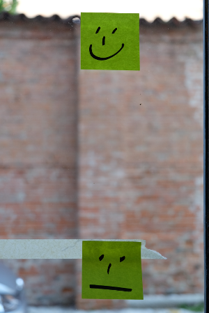]

???
---

.left-column[
## Contacts and sources
]

.right-column[
*Stefano Costa*, Bluewind R&D Managing Director

https://stefanoco.github.io/agile-at-bluewind
https://github.com/stefanoco

.pull-left[]
.pull-right[]

]

???
---

.left-column[
## Background (1)
]

.right-column[
### Bluewind

An independent Engineering Company

Provides innovative services in the field of Electronics Systems Design.
]

???
---

.left-column[
## Background (2)
]

.right-column[

### Where

We are here:

 - [Jump to position on map](http://www.openstreetmap.org/?mlat=45.68198&mlon=11.96168&zoom=14)
 - Italy
 - I-31033 Castelfranco Veneto
 - Via della Borsa 16

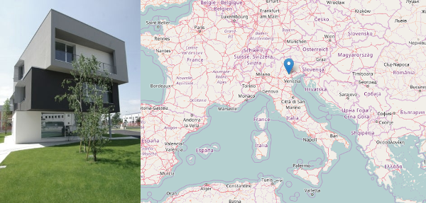

]

???
---

.left-column[
## Background (3)
]

.right-column[
### Clients

.pull-left[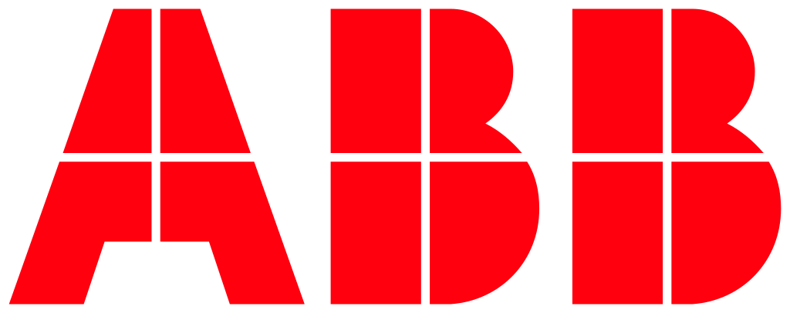]
.pull-left[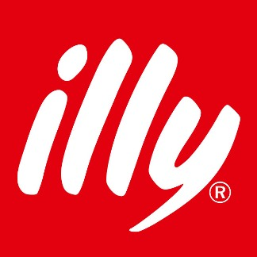]
.pull-left[]

.pull-right[]
.pull-right[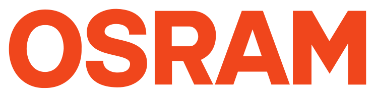]
.pull-right[]
]

???
---

.left-column[
## Background (4)
]

.right-column[
### What

By designing

* hardware boards
* embedded software
* wireless and wired solutions
* cloud automation

Bluewind provides complete product solutions,
connected and ready for the Internet of Things.

]

???
---

.left-column[
## Background (5)
]

.right-column[
### Who

An  R&D  force  of  12  experienced  engineers
plus external collaborations covering since 1997
the complete development cycle.

 - Web site: http://www.bluewind.it/
 - Full company profile: http://www.bluewind.it/cp
]

???
---

.left-column[
## Background (6)
]

.right-column[

### People

.pure-table.pure-table-bordered.pure-table-striped.smaller-font[
Person             | Matrix               | Useful as               
-------------------|----------------------|-------------------------
 *Stefano Costa*   | Partner, RD Manager  | Dev Advocate            
 *Nicola Bergamin* | Partner, BD Manager  | First Contact, Business            
]

*stefano.costa@bluewind.it*

*nicola.bergamin@bluewind.it*

]

???
---

.left-column[
## Keywords
]

.right-column[

### Selecting by categories

>fragile

>robust

>antifragile

*cit. Nassim Nicholas Taleb*
]

???
---

.left-column[
## Intro (1)
]

.right-column[

### Mindset

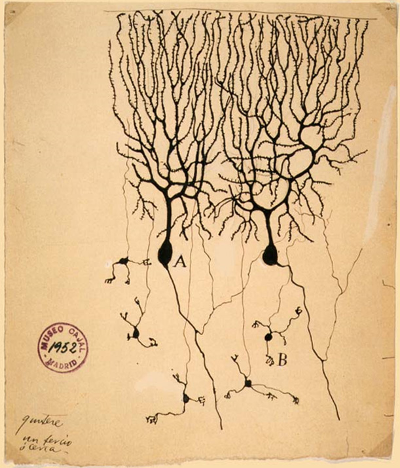

Traveling from neuroscience
to Machine Learning
and back to people

]

???
---

.left-column[
## Intro (2)
]

.right-column[

### Mindset

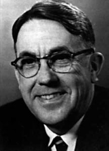

>Machine Learning: Field of study that gives computers the ability to learn without being explicitly programmed. (cit. Arthur Samuel, 1959)
]

???
---

.left-column[
## Intro (3)
]

.right-column[

### Mindset

>Algorithmic modeling

* complex
* described in details

>Machine Learning

* complex
* derived
* observed
]

???
---

.left-column[
## Intro (4)
]

.right-column[

### Mindset

Algorithmics == Command and Control == Industry

Machine Learning == Coaching == Agriculture

>by coaching instead of commanding complex processes
>I'm giving importance, responsibility and responsiveness
>to people doing things

]

???
---

.left-column[
## The past (1)
]

.right-column[

### Bluewind a few years ago

We were stuck in a *command and control*.red[*]
loop trying to manage one big team shared
between multiple projects and clients

.footnote[.red[*] sometimes robust, often fragile]
]

???
---

.left-column[
## The past (2)
]

.right-column[

### Bluewind a few years ago

* weekly meetings
* two project managers competing
* deadlines and assignments
* complaints about final deliveries
]

???
---

.left-column[
## The past (3)
]

.right-column[

### Where everything started

While meeting people at the Agile Business Day 2016 (Venice)

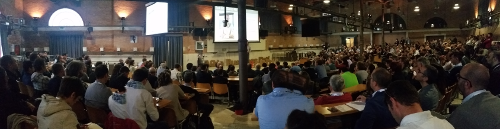
]

???
---

.left-column[
## The past (4)
]

.right-column[

### Where everything started

>we started organizing our ideas under the umbrella of Agile

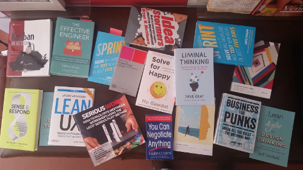

* give names to ideas
* share your experience
* build your opinion and compare
]

???
---

.left-column[
## Learning (1)
]

.right-column[

### How we learn

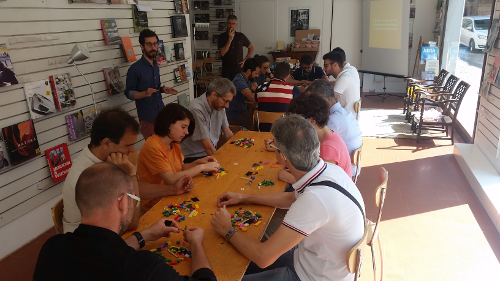

* workshops and not lessons
* everyone in the company must join.red[*]
* clients involved, immediate feedback.red[*]
* workshops in external facilities (bookshop, fablab)

.footnote[.red[*] highly antifragile]
]

???
---

.left-column[
## Learning (2)
]

.right-column[

### We now have something to compare

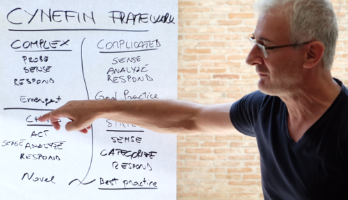

>an experience of change to be compared to others and discussed
]

???
---

.left-column[
## Learning (3)
]

.right-column[

### Now part of Bluewind

>inclusiveness.red[*] vs exclusiveness

>kindness vs arrogantness

>pull vs push

>3D.red[*] vs 2D or 0D

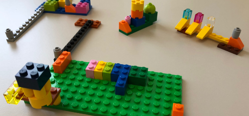

.footnote[.red[*] antifragile]
]

???
---

.left-column[
## Agile for IoT (1)
]

.right-column[

### Designing connected devices

Three steps while designing for IoT:

* capturing requirements
* contracting
* developing
]

???
---

.left-column[
## Agile for IoT (2)
]

.right-column[

### Capturing requirements for IoT

* a lack of ideas: *the paradigm*
* the one inclusive document
]

???
---

.left-column[
## Agile for IoT (3)
]

.right-column[

### Capturing requirements for IoT

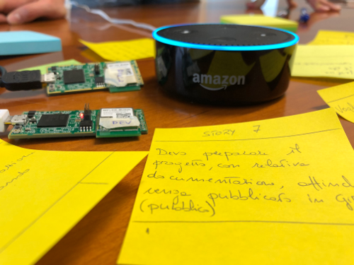

 Improve:

* iterative interviews and discussions.red[*]

.footnote[.red[*] antifragile]
]

???
---

.left-column[
## Agile for IoT (4)
]

.right-column[

### Contracting for IoT

* fixed price
* time and materials
* precise forecasts under volatile conditions
]

???
---

.left-column[
## Agile for IoT (5)
]

.right-column[

### Contracting for IoT

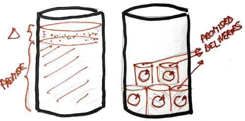

Improve (cit. Jacopo Romei, Vasco Duarte):

* NoEstimates and ExtremeContracts.red[*]

.footnote[.red[*] antifragile]
]

???
---

.left-column[
## Agile for IoT (6)
]

.right-column[

### Developing IoT solutions

* one big team, each developer solves one problem
* each developer assigned to one client
* deadlines to meet
]

???
---

.left-column[
## Agile for IoT (7)
]

.right-column[

### Developing IoT solutions

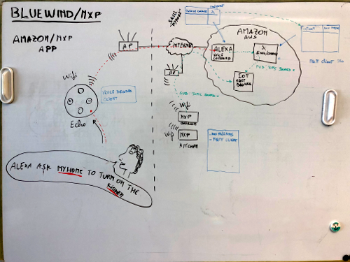

Improve:

* variable length sprints
* mixed teams
* pulled assignments.red[*]

.footnote[.red[*] antifragile]
]

???
---

.left-column[
## Agile for IoT (8)
]

.right-column[

### Developing IoT solutions

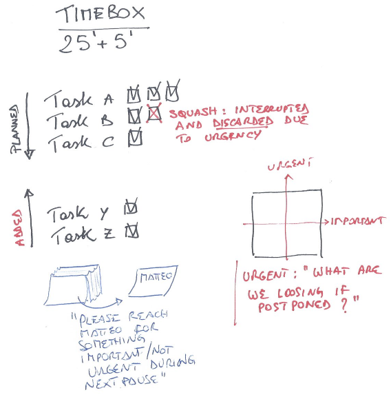

Improve: (cit. Jacopo Romei)

* work with timeboxes.red[*]

.footnote[.red[*] antifragile]
]

???
---

.left-column[
## Agile for IoT (9)
]

.right-column[

### Things to be improved

* people not always fit for Agile
* under stress: seems to be useful to skip cerimonies
* decouple our process / clients process
* estimates and contracts
]

???
---

.left-column[
## Agile case history (1)
]

.right-column[

### Story 1

>The case of a product that needs to be developed to the end, even if canceled by marketing and sales

* a big Gantt maintained weekly
* marketing and sales point of contact: maybe the product manager
* an internal team of strong individuals with roles
* a department that was said to be canceled
* all features *must* be develped 100%
* no budget, almost no constrains
]

???
---

.left-column[
## Agile case history (2)
]

.right-column[

### Story 1

>The case of a product that needs to be developed to the end, even if canceled by marketing and sales

What worked here:

* use TDD in order to deliver constantly
* use sprint in order not to lose focus
* open discussion, try to help taking decisions

]

???
---

.left-column[
## Agile case history (3)
]

.right-column[

### Story 2

>The case of a product that needs to be developed, even if we don't know what - why - when

* moving deadlines
* evolving features list
* details only in one person's head
* fixed budget
* mandatory: win the tender
]

???
---

.left-column[
## Agile case history (4)
]

.right-column[

### Story 2

>The case of a product that needs to be developed, even if we don't know what - why - when

What worked here:

* sprint cycles
* client involved at each sprint
* write architectural details *for internal use*
* deliveries well described
* test plans
* shared git repository
]

???
---

# Thanks for sharing your ideas

>Doubts?

>Ideas?

>Will you try and share?

* stefano.costa@bluewind.it
* +393356565749

???
